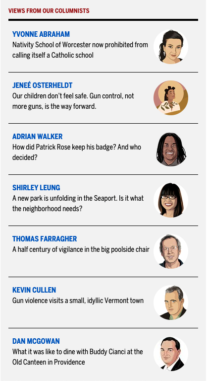

# card-exercises

#### Table of Contents
1. [User Card](#user-card)
2. [Editors List](#editors-list)

# Description

These are examples I created to practice fundamental skills. Inspiration/reference photos are used for layout, design, etc.

# User Card

A user card using HTML & CSS.

##  My user card

### Inspiration photo:

# Editors List
An Editors List using HTML & CSS.

## My Editors list

### Design Reference:

